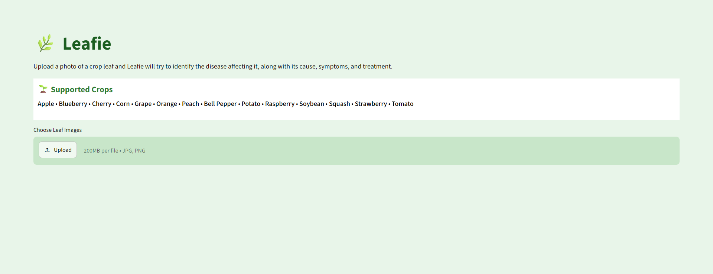
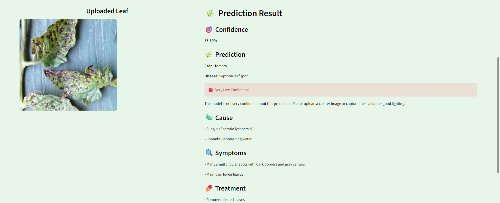

🌿 Leafie

AI-Powered Crop Disease Detection from Leaf Images

Leafie is a deep learning web app that identifies plant diseases from a photo of a leaf. Upload an image, and it predicts the crop and the disease affecting it, along with the cause, symptoms, and treatment — plus a confidence score so you know how much to trust the prediction.

Live Demo
🔗 https://leafie.streamlit.app





📌 Features

- 🖼 Leaf image upload and instant prediction
- 🌾 Covers 14 crops and 38 disease/healthy classes
- 🎯 Confidence score with a Very High → Very Low scale
- 🦠 Cause, symptoms, and treatment for the detected disease
- 📄 Downloadable text report of the result
- 🎨 Light green themed Streamlit interface

🛠 Tech Stack

Programming Language
- Python 3

Deep Learning
- TensorFlow / Keras (training)
- TensorFlow Lite (deployment — quantized for a lighter, faster-loading app)

Image Processing
- Pillow (PIL)
- NumPy

Web Framework
- Streamlit (deployed on Streamlit Community Cloud)

📂 Dataset

The model is trained on the **PlantVillage dataset**, containing leaf images across 38 classes spanning 14 crops:

Apple • Blueberry • Cherry • Corn • Grape • Orange • Peach • Bell Pepper • Potato • Raspberry • Soybean • Squash • Strawberry • Tomato

Each class is either a specific disease (e.g. `Tomato___Early_blight`) or a healthy leaf (e.g. `Tomato___healthy`).

🧠 Model

Leafie uses a custom Convolutional Neural Network trained from scratch (no transfer learning) on 224×224 RGB leaf images:

```
Conv2D(32) → MaxPooling
Conv2D(64) → MaxPooling
Conv2D(128) → MaxPooling
Flatten
Dense(256) + Dropout(0.5)
Dense(38, softmax)
```

- Optimizer: Adam
- Loss: Sparse Categorical Crossentropy
- Early stopping on validation accuracy (patience = 3)
- Best validation accuracy: **~86.3%**

For deployment, the trained `.keras` model is converted and quantized to **TensorFlow Lite**, shrinking it from ~255MB to ~21MB with no meaningful accuracy loss — this keeps the app lightweight and fast to load on Streamlit Cloud.

⚙️ How It Works

Step 1 — Upload
The user uploads a photo of a crop leaf (JPG/PNG).

Step 2 — Preprocessing
The image is resized to 224×224 and converted to a NumPy array.

Step 3 — Prediction
The TFLite interpreter runs the CNN and outputs a probability distribution over 38 classes. The class with the highest probability is taken as the prediction, and its probability becomes the confidence score.

Step 4 — Confidence Interpretation

| Confidence | Label |
|---|---|
| ≥ 90% | 🟢 Very High |
| 75–89% | 🟢 High |
| 60–74% | 🟡 Moderate |
| 40–59% | 🟠 Low |
| < 40% | 🔴 Very Low — user is prompted to retake the photo |

Step 5 — Disease Info
Based on the predicted class, Leafie displays the cause, symptoms, and treatment, and lets the user download a summary report.

🚀 Running Locally

Install dependencies
```
pip install -r requirements.txt
```

Run the app
```
streamlit run app.py
```

📁 Project Structure

```
Leafie/
│
├── app.py
├── convert_model.py
├── class_names.py
├── disease_info.py
├── requirements.txt
├── .streamlit/
│   └── config.toml
├── models/
│   └── crop_disease_model.tflite
└── README.md
```

🎯 Future Improvements

- Grad-CAM visualization to show which part of the leaf drove the prediction
- Confidence-based "unknown/not a leaf" detection for out-of-distribution images
- Batch prediction for multiple leaves at once
- Mobile-friendly camera capture

👩‍💻 Developed By

**Samistha Kesarwani**
IBM PBEL 3.0 AI (Batch - 02)

📄 License

This project is developed for educational and academic purposes.